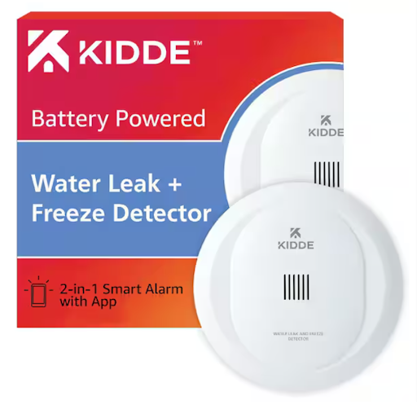
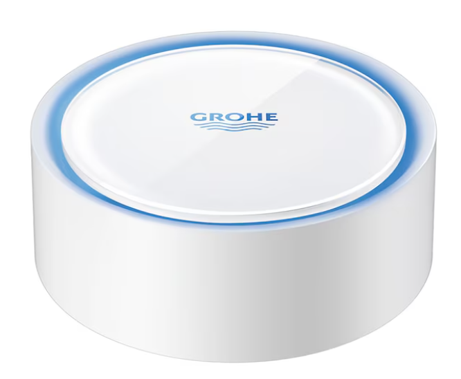
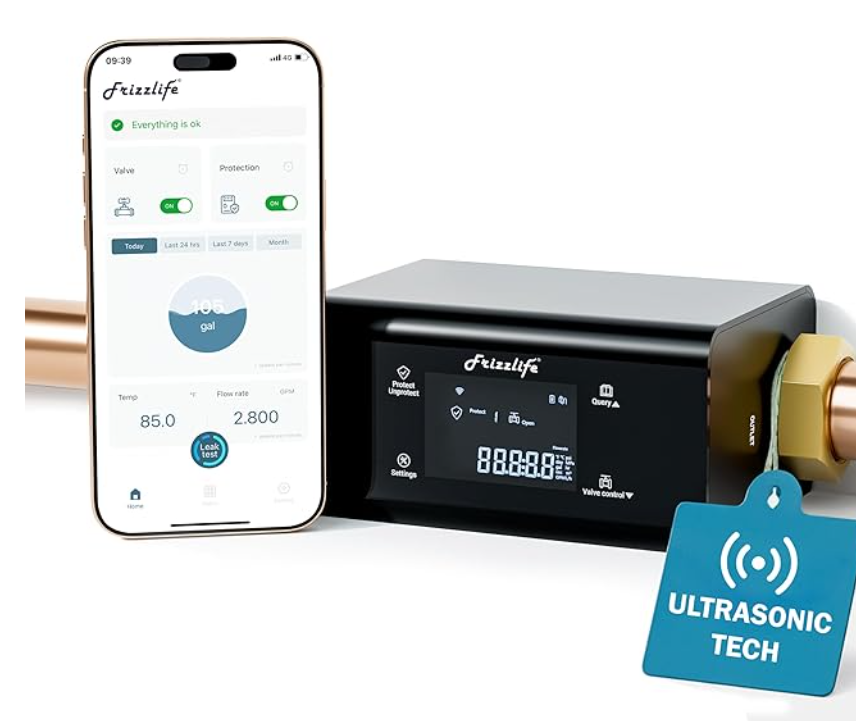
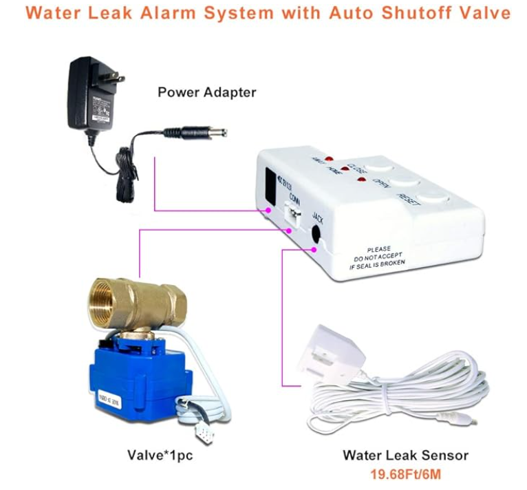
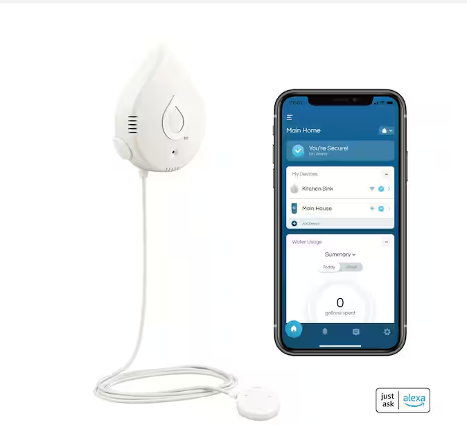
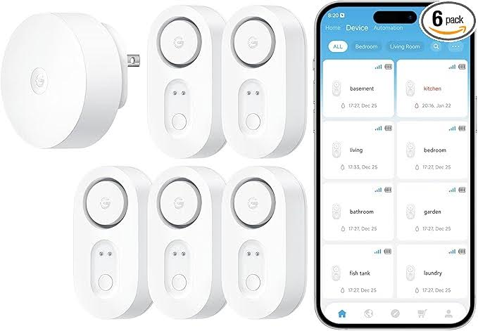
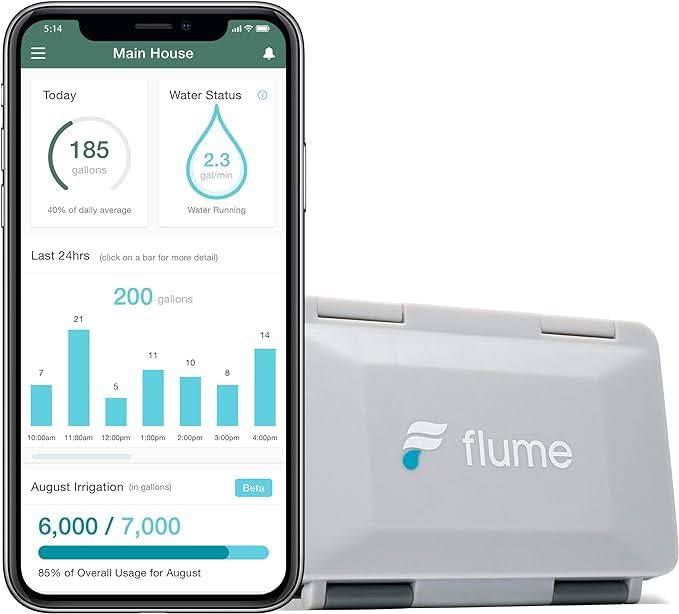

## Product Type: Water leak sensor

---

# 1. Flo 0.75 in. Smart Water Monitor and Automatic Water Shut Off Valve

**Search Query:** Water Leak Detector  
**Keywords:** Water leak system  
**Number of Reviews:** 1054 Reviews — 4.5 out of 5 Stars  
[Link](https://www.homedepot.com/p/MOEN-Flo-0-75-in-Smart-Water-Monitor-and-Automatic-Water-Shut-Off-Valve-900-001/309096191)

### POSITIVE COMMENTS
| **Voice of the Customer** | **Restated Customer Need** |
|---------------------------|-----------------------------|
| This device has been very valuable in our home. It helped me find small leaks, shut off water left on overnight, and recently alerted me to a failing Pressure Reducing Valve (PRV). With its pressure alerts and historical graphs, I saw our water pressure often exceeded 100 psi and fixed the PRV, preventing costly damage. While it sometimes misidentifies leaks and shuts off water unnecessarily, this can be improved with better setup. Overall, it’s definitely worth having. | 1. Ability to detect and alert (explicit)   2. Accurate alerts (explicit)   3. Long-term savings (latent) |

### NEGATIVE COMMENTS
| **Voice of the Customer** | **Restated Customer Need** |
|---------------------------|-----------------------------|
| Had a problem with the waste pipe backing up occasionally when the water filtration system was doing regen/backwash… Wanted a longer sensor cord… also no way to mount the control box. | 1. Mount for product (explicit)   2. Longer power cord (explicit)   3. Easy installation (latent) |

---

# 2. Smart Water Leak and Freeze Detector, Battery Operated

**Search Query:** Water Leak Detector  
**Keywords:** Water leak system  
**Number of Reviews:** 176 Reviews — 4 out of 5 Stars  
[Link](https://www.homedepot.com/p/Kidde-Smart-Water-Leak-and-Freeze-Detector-Battery-Operated-21031205/320218668)

### POSITIVE COMMENTS
| **Voice of the Customer** | **Restated Customer Need** |
|---------------------------|-----------------------------|
| The Kidde/Carrier detector is easy to set up, integrates with the app and smart assistants, and is affordable with reliable quality. Loud alarms, app controls, simple installation… but AA batteries last only a year and nuisance alarms can only be hushed on the same network. | 1. Easy setup (explicit)   2. Affordable (explicit)   3. Long-term reliability (latent) |

### NEGATIVE COMMENTS
| **Voice of the Customer** | **Restated Customer Need** |
|---------------------------|-----------------------------|
| The unit repeatedly alarmed and shut off water randomly despite following instructions. | 1. Reliable sensors (explicit)   2. Dependable functionality (explicit)   3. Peace of mind (latent) |

---

# 3. E-SDS Water Leak Detector

**Search Query:** Water Leak Detector & Alarms  
**Keywords:** Water leak system  
**Number of Reviews:** 162 Reviews — 4.1 out of 5 Stars  
[Link](https://www.amazon.com/Detector-Shutoff-Sensors-Automatic-Prevention/dp/B07C5PS64P?th=1)

---

# 4. Frizzlife LP365 Smart Water Monitor

**Search Query:** Water Leak Detector & Alarms  
**Keywords:** Water leak system  
**Number of Reviews:** 69 Reviews — 4.6 out of 5 Stars  
[Link](https://www.amazon.com/dp/B0DSKG73XB)

### POSITIVE COMMENTS
| **Voice of the Customer** | **Restated Customer Need** |
|---------------------------|-----------------------------|
| This Frizzlife water shutoff valve is well-built, integrates smoothly with SmartHome/Tuya, and is easy to install. App works reliably, support is responsive, documentation is clear… takes ~20 seconds to fully close… allows configurable leak detection. | 1. App reliability (explicit)   2. Straightforward setup & instructions (explicit)   3. Customer support (latent) |

### NEGATIVE COMMENTS
| **Voice of the Customer** | **Restated Customer Need** |
|---------------------------|-----------------------------|
| Useful for remote homes… but tedious to set up many devices… serial numbers too small… wish it were easier to add House Manager to app. | 1. Easier Wi-Fi setup (explicit)   2. Peace of mind & dependable protection (explicit)   3. Trustworthy product (latent) |

---

# 5. GROHE Indoor Smart Compatible Water Leak Detector

**Search Query:** Water Leak Detector System  
**Keywords:** Water leak system  
**Number of Reviews:** 30 Reviews — 4.6 out of 5 Stars  
[Link](https://www.lowes.com/pd/GROHE-GROHE-22601LN0-Water-Leak-Detectors/5015174141)

---

# 6. SimpliSafe - Water Sensor

**Search Query:** Water leak sensor  
**Keywords:** —  
**Number of Reviews:** 210 Reviews — 4.7 out of 5 Stars  
[Link](https://www.bestbuy.com/product/simplisafe-water-sensor-white/J3L6GWR5PW/sku/6305563?extStoreId=1189)

### POSITIVE COMMENTS
| **Voice of the Customer** | **Restated Customer Need** |
|---------------------------|-----------------------------|
| These models were easy to set up… didn’t take up too much space… not an eyesore in the home. | 1. Easy setup (explicit)   2. Non-intrusive design (latent)   3. Flexible sizing (explicit) |

---

# 7. Alarm Flood And Freeze Sensor, Wireless

**Search Query:** Water leak sensor  
**Keywords:** —  
**Number of Reviews:** 23 Reviews — 4.5 out of 5 Stars  
[Link](https://www.homedepot.com/p/Ring-Alarm-Flood-And-Freeze-Sensor-Wireless-4SF1S8-0EN0/308508194)

### NEGATIVE COMMENTS
| **Voice of the Customer** | **Restated Customer Need** |
|---------------------------|-----------------------------|
| The alarm is far too quiet… if unheard, the device fails its job… casing may dampen sound. | 1. Louder alarm (explicit)   2. Alerts must be audible (explicit)   3. Reliability across multiple alarms (latent) |

---

# 8. Water Heater and Sump Pump Re-Useable Water Leak Detector

**Number of Reviews:** 176 Reviews — 4 out of 5 Stars  
[Link](https://www.homedepot.com/p/Resideo-Water-Heater-and-Sump-Pump-Re-Useable-Water-Leak-Detector-with-Alarm-RWD21/204116885)

### POSITIVE COMMENTS
| **Voice of the Customer** | **Restated Customer Need** |
|---------------------------|-----------------------------|
| An inexpensive way to prevent costly repairs… catches leaks early… affordable for all buyers. | 1. Affordability (explicit)   2. Early leak prevention (explicit)   3. Long-term savings (latent) |

---

# 9. Eufy Water and Freeze Sensor with Remote Alerts

**Number of Reviews:** 34 Reviews — 4.5 out of 5 Stars  
[Link](https://www.eufy.com/products/t89200d1?variant=42863746252986)

### POSITIVE COMMENTS
| **Voice of the Customer** | **Restated Customer Need** |
|---------------------------|-----------------------------|
| Integrates easily with other devices… faster setup… no extra software bloat. | 1. Easy integration (explicit)   2. Fast setup (explicit)   3. Streamlined user experience (latent) |

### NEGATIVE COMMENTS
| **Voice of the Customer** | **Restated Customer Need** |
|---------------------------|-----------------------------|
| Weak battery means constant replacement… upkeep becomes costly… annoying low-battery beeps. | 1. Longer battery life (explicit)   2. Lower upkeep costs (latent)   3. Fewer nuisance alerts (explicit) |

---

# 10. Wi-Fi Water Leak Detector for Home (APEC)

**Number of Reviews:** 1 Review — 3 out of 5 Stars  
[Link](https://www.apecwater.com/products/wifi-water-leak-detector-for-home-app-connected-get-real-time-alerts-highly-reliable-dual-sensor-wet-moisture-detection)

### NEGATIVE COMMENTS
| **Voice of the Customer** | **Restated Customer Need** |
|---------------------------|-----------------------------|
| False alarms when there is no water… device does not beep at false negatives… frustration with unnecessary alerts. | 1. Accurate detection (explicit)   2. Avoid false alarms (explicit)   3. Reduce wasted time & battery (latent) |

---

# 11. Smart Leak Detectors (1-Pack)

**Search Query:** Water leak detector  
**Keywords:** Leak detector  
**Number of Reviews:** 271 Reviews — 4 out of 5 Stars  
[Link](https://www.homedepot.com/p/MOEN-Smart-Leak-Detectors-1-Pack-920-004/312855333)

### POSITIVE COMMENTS
| **Voice of the Customer** | **Restated Customer Need** |
|---------------------------|-----------------------------|
| Great product… installation somewhat complicated… app requests too much info… system provides great alerts… battery replacement is easy. | 1. Accurate notifications (explicit)   2. Simple installation (explicit)   3. Long-lasting, easy-to-replace batteries (latent) |

---

# 12. GoveeLife Upgraded Smart Water Leak Detector

**Search Query:** Water leak detector  
**Keywords:** Leak detector  
**Number of Reviews:** 570 Reviews — 4.5 out of 5 Stars  
[Link](https://a.co/d/1rRC8sh)

### POSITIVE COMMENTS
| **Voice of the Customer** | **Restated Customer Need** |
|---------------------------|-----------------------------|
| Super useful… water bills now accurate… leak detection rocks… installation is easy… battery compartment should be waterproof. | 1. Accurate water tracking (explicit)   2. Reliable leak detection (explicit)   3. Waterproof battery compartment (latent) |

### NEGATIVE COMMENTS
| **Voice of the Customer** | **Restated Customer Need** |
|---------------------------|-----------------------------|
| Impossible to connect to Wi-Fi… seller kept $20 from return… untrustworthy experience. | 1. Simple Wi-Fi setup (explicit)   2. Fair refund process (explicit)   3. Transparent service (latent) |

---

# 13. Flume 2 Smart Home Water Monitor & Leak Detector

**Search Query:** Water leak monitor and detector  
**Keywords:** Leak detector  
**Number of Reviews:** 1883 Reviews — 4 out of 5 Stars  
[Link](https://a.co/d/e8ZM4zx)

### NEGATIVE COMMENTS
| **Voice of the Customer** | **Restated Customer Need** |
|---------------------------|-----------------------------|
| Battery pack changed to proprietary… poor range… no signal strength meter… needed supervisor to diagnose issue. | 1. Replaceable non-proprietary batteries (explicit)   2. Better wireless range (explicit)   3. Diagnostic tools like signal strength indicator (explicit)   4. Environmentally responsible design (latent) |

---

# 14. SwitchBot WiFi Smart Water Leak Sensor

**Search Query:** Water Leak Sensor  
**Keywords:** Leak detection  
**Number of Reviews:** 1010 Reviews — 4.5 out of 5 Stars  
[Link](https://www.amazon.com/dp/B0B7ZLZP9Q)

### POSITIVE COMMENTS
| **Voice of the Customer** | **Restated Customer Need** |
|---------------------------|-----------------------------|
| Fantastic sensors… simple setup… highly sensitive… instant notifications… easy reset… peace of mind across home. | 1. Easy operation & app experience (explicit)   2. Peace of mind (explicit)   3. Simple setup (explicit)   4. Reliable full-home performance (latent) |

### NEGATIVE COMMENTS
| **Voice of the Customer** | **Restated Customer Need** |
|---------------------------|-----------------------------|
| Notifications do not work when app is closed… troubleshooting unsuccessful… returned sensors. | 1. App-independent notifications (explicit)   2. More tolerant connectivity needs (latent)   3. Clearer app–phone integration (explicit) |

---

# 15. Moen Flo Smart Water Monitor and Automatic Shutoff Sensor

**Search Query:** Water pipe leak detection sensor  
**Keywords:** Pipe, leak detection  
**Number of Reviews:** 1960 Reviews — 3.8 out of 5 Stars  
[Link](https://www.amazon.com/dp/B07C5PS64P)

### POSITIVE COMMENTS
| **Voice of the Customer** | **Restated Customer Need** |
|---------------------------|-----------------------------|
| Works great with Home Assistant… Bluetooth improves battery life… easy setup… very sensitive sensors… instant shutoff automation. | 1. Smart home integration (explicit)   2. Long battery life (explicit)   3. Whole-home automation (explicit)   4. Multi-sensor protection (latent) |

### NEGATIVE COMMENTS
| **Voice of the Customer** | **Restated Customer Need** |
|---------------------------|-----------------------------|
| Device constantly goes offline… must be reset weekly… nighttime alerts too weak to wake user. | 1. Stable connectivity (explicit)   2. Strong nighttime alerting (explicit)   3. Better accessibility and livability (latent) |

---

# 16. YoLink DIY Automatic Water Leak Detection & Shut-Off Starter Kit

**Search Query:** Smart home system water leak sensor  
**Keywords:** Smart home, system  
**Number of Reviews:** 267 Reviews — 4.6 out of 5 Stars  
[Link](https://www.amazon.com/YoLink-Automatic-Detection-Manipulator-Controller/dp/B098QP4ZLH)

---

# 17. FloodStop Water Sensor

**Search Query:** Refrigerator Water Leak Sensor  
**Keywords:** Refrigerator, leak  
**Number of Reviews:** 192 Reviews — 4.4 out of 5 Stars  
[Link](https://www.amazon.com/dp/B001GUNJJO)

### POSITIVE COMMENTS
| **Voice of the Customer** | **Restated Customer Need** |
|---------------------------|-----------------------------|
| Needed to mitigate damage risk in multi-level home… sensors responsive… app alerts immediate… probes useful behind appliances… provides peace of mind. | 1. Responsive sensors (explicit)   2. Clear identification of alerts (explicit)   3. Versatile probe options (latent) |

### NEGATIVE COMMENTS
| **Voice of the Customer** | **Restated Customer Need** |
|---------------------------|-----------------------------|
| Works only 1m from hub… basement sensors fail despite strong Wi-Fi nearby… had to switch to wired system. | 1. Longer wireless range (explicit)   2. Strong alert volume (explicit)   3. Price should match performance (latent) |

---

# 18. WiFi Water Leak Detector for Home with App Notification

**Search Query:** Smart home water leak sensor  
**Keywords:** Smart home  
**Number of Reviews:** 253 Reviews — 4.5 out of 5 Stars  
[Link](https://www.amazon.com/dp/B08R61HJXN)

---

**Repeated and Most Helpful Statements From Positive Reviews:**  
- Ease of use/ Installation  
- Peace of mind  
- Value for money  
- Functionality  
- Specific models were straightforward to set up  
- Gave customers peace of mind by just working  
- Integrates easily with other devices, making it a better package overall  
- An inexpensive way to prevent a lot of repair costs, since it catches leaks before they become bigger issues  
- Compact size made it easier to set up  
- Great for spotting leaks and pressure issues, even caught a bad valve. Some false alarms but worth it.  
- Works great! Lets you check anytime and email test results.  
- Good sensors, but AA/AAA batteries would be cheaper.  
- Great product with helpful info, setup was complicated but easy battery replacement.  
- Access to historical data has been helpful in identifying water consumption and inefficiencies. — Moen  
- Alerts are immediate and timely while offering a loud noise to indicate an issue. — Switchbot  
- The valve operator comes with adapters, clamps and rings to better fit your water main’s construction — Yolink  
- Clearly labeled parts, app instructions and versatile parts make for an easy installation — Metak  
- Communication on a main hub/app that displays low battery life and other states makes usability high — Metak  

**Repeated and Most Helpful Statements From Negative Reviews:**  
- Connection/ App Issues  
- Tedious to set up (especially for products w/multiple sensors)  
- Build quality  
- Battery runs out quick (for products who use batteries)  
- False alarms when there is no water  
- A weak battery means constant replacement  
- The app for the device is not user-friendly  
- The alarm itself is far too quiet  
- Installation was complicated for some models  
- Flume 2 works but the pricey battery pack is wasteful and short-lived. No signal strength tool, first unit failed, though support replaced it.  
- 16 of 18 sensors died in under a day. Setup is tedious, only works on 2.4 GHz Wi-Fi, and other brands offer more.  
- Plumber installed it, but the valve wouldn’t connect, the app was slow, and support didn’t help. Returned it.  
- Worked at first, but later failed to detect a flood and now won’t reconnect.  
- There is a lack of clarity on where to install sensors from the manufacturer and professional consults. — Moen  
- Sensors on the device are relatively sensitive and can be set off with a small puddle if not a small drop of water — Yolink  
- The cost of replacement for the sensors is quite pricey — FloodStop  
- Not compatible with certain Wi-Fi setups (5 MHz) — Metak  
- Default settings without adjustment can create false triggers that have to be addressed in 5 minutes or water can potentially shut off. Such false triggers could include taking a shower — Moen  

