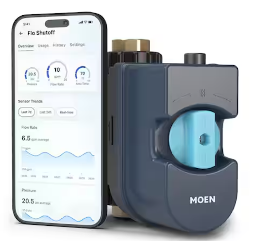

## Product Type: Water leak sensor

1. **Flo 0.75 in. Smart Water Monitor and Automatic Water Shut Off Valve**
   
   
   
   Search Query: Water Leak Detector  
   Keywords: Water leak system  
   Number of Reviews: 1054 Reviews — 4.5 out of 5 Stars  
   [Link](https://www.homedepot.com/p/MOEN-Flo-0-75-in-Smart-Water-Monitor-and-Automatic-Water-Shut-Off-Valve-900-001/309096191)  

3. **Smart Water Leak and Freeze Detector, Battery Operated**  
   Search Query: Water Leak Detector  
   Keywords: Water leak system  
   Number of Reviews: 176 Reviews — 4 out of 5 Stars  
   [Link](https://www.homedepot.com/p/Kidde-Smart-Water-Leak-and-Freeze-Detector-Battery-Operated-21031205/320218668)  

4. **E-SDS Water Leak Detector**  
   Search Query: Water Leak Detector & Alarms  
   Keywords: Water leak system  
   Number of Reviews: 162 Reviews — 4.1 out of 5 Stars  
   [Link](https://www.amazon.com/Detector-Shutoff-Sensors-Automatic-Prevention/dp/B07C5PS64P?th=1)  

5. **Frizzlife LP365 Smart Water Monitor**  
   Search Query: Water Leak Detector & Alarms  
   Keywords: Water leak system  
   Number of Reviews: 69 Reviews — 4.6 out of 5 Stars  
   [Link](https://www.amazon.com/dp/B0DSKG73XB)  

6. **GROHE Indoor Smart Compatible Water Leak Detector**  
   Search Query: Water Leak Detector System  
   Keywords: Water leak system  
   Number of Reviews: 30 Reviews — 4.6 out of 5 Stars  
   [Link](https://www.lowes.com/pd/GROHE-GROHE-22601LN0-Water-Leak-Detectors/5015174141)  

7. **SimpliSafe - Water Sensor**  
   Search Query: Water leak sensor  
   Keywords: —  
   Number of Reviews: 210 Reviews — 4.7 out of 5 Stars  
   [Link](https://www.bestbuy.com/product/simplisafe-water-sensor-white/J3L6GWR5PW/sku/6305563?extStoreId=1189)  

8. **Alarm Flood And Freeze Sensor, Wireless**  
   Search Query: Water leak sensor  
   Keywords: —  
   Number of Reviews: 23 Reviews — 4.5 out of 5 Stars  
   [Link](https://www.homedepot.com/p/Ring-Alarm-Flood-And-Freeze-Sensor-Wireless-4SF1S8-0EN0/308508194)  

9. **Water Heater and Sump Pump Re-Useable Water Leak Detector with Alarm**  
   Search Query: —  
   Keywords: —  
   Number of Reviews: 176 Reviews — 4 out of 5 Stars  
   [Link](https://www.homedepot.com/p/Resideo-Water-Heater-and-Sump-Pump-Re-Useable-Water-Leak-Detector-with-Alarm-RWD21/204116885)  

10. **Eufy Water and Freeze Sensor with Remote Alerts**  
   Search Query: —  
   Keywords: —  
   Number of Reviews: 34 Reviews — 4.5 out of 5 Stars  
   [Link](https://www.eufy.com/products/t89200d1?variant=42863746252986)  

11. **Wi-Fi Water Leak Detector for Home, App Connected, Get Instant Alerts**  
    Search Query: —  
    Keywords: —  
    Number of Reviews: 1 Review — 3 out of 5 Stars  
    [Link](https://www.apecwater.com/products/wifi-water-leak-detector-for-home-app-connected-get-real-time-alerts-highly-reliable-dual-sensor-wet-moisture-detection)  

12. **Smart Leak Detectors (1-Pack)**  
    Search Query: Water leak detector  
    Keywords: Leak detector  
    Number of Reviews: 271 Reviews — 4 out of 5 Stars  
    [Link](https://www.homedepot.com/p/MOEN-Smart-Leak-Detectors-1-Pack-920-004/312855333)  

13. **GoveeLife Upgraded Smart Water Leak Detector**  
    Search Query: Water leak detector  
    Keywords: Leak detector  
    Number of Reviews: 570 Reviews — 4.5 out of 5 Stars  
    [Link](https://a.co/d/1rRC8sh)  

14. **Flume 2 Smart Home Water Monitor & Leak Detector**  
    Search Query: Water leak monitor and detector  
    Keywords: Leak detector  
    Number of Reviews: 1883 Reviews — 4 out of 5 Stars  
    [Link](https://a.co/d/e8ZM4zx)  

15. **SwitchBot WiFi Smart Water Leak Sensor**  
    Search Query: Water Leak Sensor  
    Keywords: Leak detection  
    Number of Reviews: 1010 Reviews — 4.5 out of 5 Stars  
    [Link](https://www.amazon.com/dp/B0B7ZLZP9Q)  

16. **Moen Flo Smart Water Monitor and Automatic Shutoff Sensor**  
    Search Query: Water pipe leak detection sensor  
    Keywords: Pipe, leak detection  
    Number of Reviews: 1960 Reviews — 3.8 out of 5 Stars  
    [Link](https://www.amazon.com/dp/B07C5PS64P)  

17. **YoLink DIY Automatic Water Leak Detection & Shut-Off Starter Kit**  
    Search Query: Smart home system water leak sensor  
    Keywords: Smart home, system  
    Number of Reviews: 267 Reviews — 4.6 out of 5 Stars  
    [Link](https://www.amazon.com/YoLink-Automatic-Detection-Manipulator-Controller/dp/B098QP4ZLH)  

18. **FloodStop Water Sensor**  
    Search Query: Refrigerator Water Leak Sensor  
    Keywords: Refrigerator, leak  
    Number of Reviews: 192 Reviews — 4.4 out of 5 Stars  
    [Link](https://www.amazon.com/dp/B001GUNJJO)  

19. **WiFi Water Leak Detector for Home with App Notification**  
    Search Query: Smart home water leak sensor  
    Keywords: Smart home  
    Number of Reviews: 253 Reviews — 4.5 out of 5 Stars  
    [Link](https://www.amazon.com/dp/B08R61HJXN)

**Repeated and Most Helpful Statements From Positive Reviews:**  
- Ease of use/ Installation  
- Peace of mind  
- Value for money  
- Functionality  
- Specific models were straightforward to set up  
- Gave customers peace of mind by just working  
- Integrates easily with other devices, making it a better package overall  
- An inexpensive way to prevent a lot of repair costs, since it catches leaks before they become bigger issues  
- Compact size made it easier to set up  
- Great for spotting leaks and pressure issues, even caught a bad valve. Some false alarms but worth it.  
- Works great! Lets you check anytime and email test results.  
- Good sensors, but AA/AAA batteries would be cheaper.  
- Great product with helpful info, setup was complicated but easy battery replacement.  
- Access to historical data has been helpful in identifying water consumption and inefficiencies. — Moen  
- Alerts are immediate and timely while offering a loud noise to indicate an issue. — Switchbot  
- The valve operator comes with adapters, clamps and rings to better fit your water main’s construction — Yolink  
- Clearly labeled parts, app instructions and versatile parts make for an easy installation — Metak  
- Communication on a main hub/app that displays low battery life and other states makes usability high — Metak  

**Repeated and Most Helpful Statements From Negative Reviews:**  
- Connection/ App Issues  
- Tedious to set up (especially for products w/multiple sensors)  
- Build quality  
- Battery runs out quick (for products who use batteries)  
- False alarms when there is no water  
- A weak battery means constant replacement  
- The app for the device is not user-friendly  
- The alarm itself is far too quiet  
- Installation was complicated for some models  
- Flume 2 works but the pricey battery pack is wasteful and short-lived. No signal strength tool, first unit failed, though support replaced it.  
- 16 of 18 sensors died in under a day. Setup is tedious, only works on 2.4 GHz Wi-Fi, and other brands offer more.  
- Plumber installed it, but the valve wouldn’t connect, the app was slow, and support didn’t help. Returned it.  
- Worked at first, but later failed to detect a flood and now won’t reconnect.  
- There is a lack of clarity on where to install sensors from the manufacturer and professional consults. — Moen  
- Sensors on the device are relatively sensitive and can be set off with a small puddle if not a small drop of water — Yolink  
- The cost of replacement for the sensors is quite pricey — FloodStop  
- Not compatible with certain Wi-Fi setups (5 MHz) — Metak  
- Default settings without adjustment can create false triggers that have to be addressed in 5 minutes or water can potentially shut off. Such false triggers could include taking a shower — Moen  

### Positive Reviews Summary

| Voice of Customer | Restated Customer Need |
|-----------------|----------------------|
| This device has been very valuable in our home. It helped me find small leaks, shut off water left on overnight, and recently alerted me to a failing Pressure Reducing Valve (PRV). With its pressure alerts and historical graphs, I saw our water pressure often exceeded 100 psi and fixed the PRV, preventing costly damage. While it sometimes misidentifies leaks and shuts off water unnecessarily, this can be improved with better setup. Overall, it’s definitely worth having. | Ability to detect and alert (explicit); Accurate alerts (explicit); Long term savings (latent) |
| The Kidde/Carrier detector is easy to set up, integrates with the app and smart assistants, and is affordable with reliable quality. It has loud alarms, app-based controls, and simple installation. However, the AA batteries last only about a year, nuisance alarms can only be hushed on the same Wi-Fi network, and it’s limited to indoor use. | Easy Set up (explicit); Affordable (explicit); Long-term reliability (latent) |
| This Frizzlife water shutoff valve is well-built, integrates smoothly with SmartHome/Tuya, and is easy to install. The app works reliably, customer support was responsive, and documentation is clear. It takes about 20 seconds to fully close but seals completely and offers configurable leak detection. The unit also allows swapping inlet/outlet sides easily. | App Reliability (explicit); Straightforward setup and instructions (explicit); Customer Support (latent) |
| These models were easy to set up and didn’t take up too much space. Device setup is a 5-10 step process before it starts working. The device isn’t a complete eyesore. Size can cause the device to not fit in some areas. | Compact and user-friendly setup (latent); Fits in most spaces (latent) |
| An inexpensive way to prevent a lot of repair costs, since it catches leaks before they become bigger issues. Integrates easily with other devices, making it a better package overall. | Cost-effective protection (latent); Easy integration with other devices (latent) |
| This device has proved to be very valuable in our home. It’s helped identify multiple small leaks, shut off water when things were left on overnight, and helped identify a failing PRV. Sends high pressure alerts and provides historic graphs of flow-rate and water pressure. | Detect leaks and send alerts (explicit); Track water pressure and flow to prevent damage (explicit); Allow configurable alerts to reduce false alarms (latent) |
| This is a great product although as a new install I don’t know how it will hold up over time. Installation procedure was somewhat complicated. Battery replacement is a breeze. | Get accurate, useful notifications (explicit); Simple installation and setup (explicit); Long-lasting, easy-to-replace batteries (latent) |
| Product has been super useful. Manual readings were inaccurate. Now bill is lower. Installation was a breeze. | Accurately track water usage (explicit); Detects leaks reliably (explicit); Cost savings (latent) |
| If you have Home Assistant for home automation and need leak sensors these work great. Setup is easy, pop in batteries, check detection, then configure automations. | Automation allows monitoring across system (explicit); Battery life lengthened via Bluetooth (explicit); Multiple sensors ease customer mind (latent) |
| SwitchBot Water Detectors are fantastic! Installation and setup are incredibly simple. Detectors are highly sensitive to water leaks. Notifications sent instantly. Alarm reset is effortless. | Operation is easy (explicit); Peace of mind (explicit); Easy setup (explicit); Highly effective for entire house (explicit); Versatile sensors (latent); Responsive sensors (explicit); Initial setup clarity (explicit) |

### Negative Reviews Summary

| Voice of Customer | Restated Customer Need |
|-----------------|----------------------|
| Had a problem with the waste pipe backing up occasionally when the water filtration system was doing regen/backwash. Took a little bit to install, and get it right but that was more user error than anything. It would be nice if they offered a longer sensor cord as I wanted to use that for our hot water heater which was in another room, but can use an audio extension cable to extend the reach or splice the cord. Also, no way to mount the control box, but heavy-duty Velcro worked very well. | Mount for product (explicit); Longer power cord (explicit); Easy Installation (latent) |
| This both an ALARM and SHUT OFF, direct electrical (battery is optional) unit, does NOT work. There was substantial plumbing expense to link and attach plumbing (shut on & off) valve. Tested immediately. Sensors were easily activated when touched by hand (humidity). Quickly resolved by wearing gloves. Three (3) days later THIS product was RANDOMLY setting alarm in and shutting water valve Off. This again and again, despite following instructions to the letter RESETTING and opening the water valve. The UNIT Repeatedly ALARMED & shut OFF water constantly | Reliable Sensors (explicit); Dependable Functionality (explicit); Peace of Mind (latent) |
| Very useful device particularly for a remote home. I have these devices all over two homes. In one of the homes I also have the water shut off valve. Having once experienced a broken toilet that cost $66,000 in insured losses I'm keen to head off problems before they get out of hand. My only concern was it is a bit tedious to set up a lot of these at once, I wish it was easier to do the WiFi setup. Part of this is that their serial numbers used in WiFi setup are unnecessarily complex and the type is very small on labels. | Dependable protection from leaks and peace of mind (explicit); Easier and more user-friendly Wi-Fi setup (explicit); Trustworthy product (latent) |
| False alarms when there is no water. The device does not beep at false negatives, causing issues with reliability. Frustrations in hearing beeps when there is no reason for them to be heard. Can result in battery replacement when the device still has perfectly fine batteries. A weak battery means constant replacement. Constant battery changes can result in the price for upkeep being too high to be justifiable. | Reduce false alarms (explicit); Minimize battery replacement (explicit); Improve reliability (latent) |
| I have had my Flume 2 for two years now. Works great- but lowering stars due to Flume’s changing the replacement battery to “proprietary”. My original pack lasted two years. Field reports indicate these cells last far less than the factory Everready cells that came in my original Flume2. | Long-lasting, user-replaceable batteries (explicit); Sustainable design (latent) |
| First, I LOVE the FLUME 2, when it worked. The first unit I received worked for 12 hrs- then it lost connection between the Bridge and the sensor. Needed to escalate to get replacement unit. | Accurate water usage tracking (explicit); Quick, reliable connection (explicit); Responsive customer support (latent) |
| Great concept, when first bought this 3 pack, setup was easy. Forward a year later, multiple email alerts of water by main, but sensor at sump pump never went off. | Detect leaks reliably (explicit); Send timely alerts (explicit); Maintain consistent long-term performance (latent) |
| Buyer beware! Bought two units based on reviews. Impossible to connect to Wi-Fi, partial refund issue. | Simple, reliable Wi-Fi setup (explicit); Fair, hassle-free returns (explicit); Transparent, trustworthy experience (latent) |
| Device constantly goes offline. Notifications once a week, requiring reset. App alarm not sufficient at night. | Stable connection (explicit); Better nighttime alert system (explicit); Improve device livability/accessibility (latent) |
| SwitchBot leak detector not sending notifications when app is closed on Pixel 8. Troubleshooting steps followed, no notifications. Finally returned sensors. | App interactions simplified (explicit); Increased tolerance for setup parameters (latent); Notifications independent of app open (latent) |
| Very reactive detector on water presence. Limited range in basement; low ringtone. Returned for wired 120 dB alarm. | Extend sensor range (explicit); Price matches product efficacy (latent); Higher alarm volume (explicit) |
