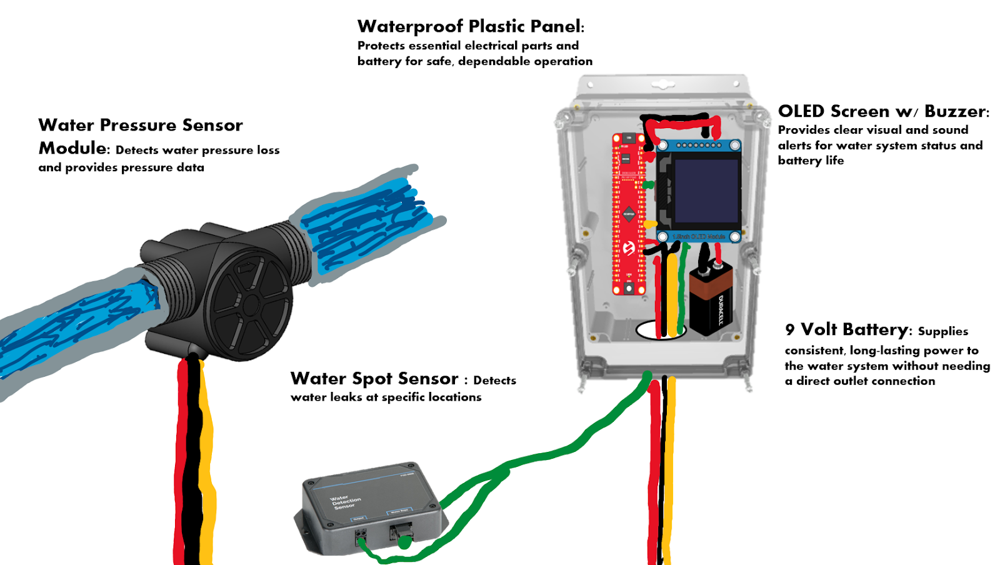
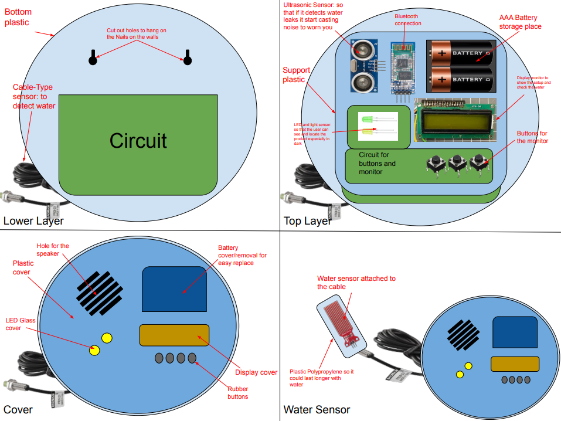
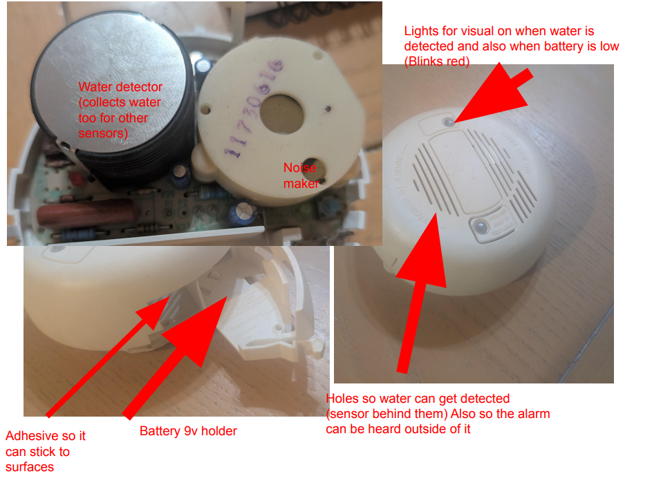

## Generated Ideas

| #   | Requirement / Need                                                            | Feature                                        | Detail                                                                                                                                |
| --- | ----------------------------------------------------------------------------- | ---------------------------------------------- | ------------------------------------------------------------------------------------------------------------------------------------- |
| 1   | The product shall run off batteries so it doesn’t fail during a power outage. | AA battery pack                                | The device has a place to store AA batteries                                                                                          |
| 2   | The product shall run off batteries so it doesn’t fail during a power outage. | AAA battery pack                               | The device has a place to store AAA batteries                                                                                         |
| 3   | The product shall run off batteries so it doesn’t fail during a power outage. | AAAA battery pack                              | The device has a place to store AAAA batteries                                                                                        |
| 4   | The product shall run off batteries so it doesn’t fail during a power outage. | 9V battery pack                                | The device has a place to store a 9V battery                                                                                          |
| 5   | The product shall run off batteries so it doesn’t fail during a power outage. | 3.7V battery pack                              | The device has a place to store a 3.7V lithium-ion battery                                                                            |
| 6   | The product shall run off batteries so it doesn’t fail during a power outage. | Rechargeable battery pack                      | The device has a place to store rechargeable batteries charged via solar panel (ideally for exterior use)                             |
| 7   | The product shall run off batteries so it doesn’t fail during a power outage. | Additional, redundant battery pack             | The product will allow for additional batteries of “x” size so that once the initial supply dies, there is an additional grace period |
| 8   | The product shall run off batteries so it doesn’t fail during a power outage. | Outlet connection and battery pack combination | The product will draw most of its power from the outlet, and once this dips below a certain level the battery pack will kick in       |
| 9   | The product shall run off batteries so it doesn’t fail during a power outage. | Mini turbines                                  | Small turbines that can translate the leaking water into energy to power the product                                                  |
| 10  | The product shall run off batteries so it doesn’t fail during a power outage. | Thermoelectric power                           | The device can utilize an appliance's heat generated to create an electric current and store energy in the batteries                  |
| 11  | The product shall be durable in construction.                                 | ABS Plastic                                    | The housing is made out of ABS plastic                                                                                                |
| 12  | The product shall be durable in construction.                                 | Polypropylene Plastic                          | The housing is made out of polypropylene plastic                                                                                      |
| 13  | The product shall be durable in construction.                                 | Polyethylene Plastic                           | The housing is made out of polyethylene plastic                                                                                       |
| 14  | The product shall be durable in construction.                                 | Polycarbonate Plastic                          | The housing is made out of polycarbonate plastic                                                                                      |
| 15  | The product shall be durable in construction.                                 | 3D Printed Shell                               | The housing is made out of 3D printed thermoplastics                                                                                  |
| 16  | The product shall be durable in construction.                                 | Polycarbonate, flame-retardant Plastic         | The housing is made out of flame-retardant polycarbonate                                                                              |
| 17  | The product shall be durable in construction.                                 | Polyurethane                                   | The housing is made out of polyurethane                                                                                               |
| 18  | The product shall be durable in construction.                                 | Rubber Coating                                 | The housing has a thin rubberized coating                                                                                             |
| 19  | The product shall be durable in construction.                                 | Polyamide (Nylon)                              | The housing is made out of Nylon                                                                                                      |
| 20  | The product shall be durable in construction.                                 | Fiberglass Reinforced Plastic                  | The housing is made out of fiberglass reinforced plastic                                                                              |
| 21  | The product shall be waterproof.                                              | Waterproof plastic                             | A waterproof housing prevents internal circuit damage                                                                                 |
| 22  | The product shall be waterproof.                                              | Silicone sealing                               | A silicone layer protects electronics                                                                                                 |
| 23  | The product shall be waterproof.                                              | Gasket seals                                   | Gasket rings protect water entry points                                                                                               |
| 24  | The product shall be waterproof.                                              | Rubber O-rings                                 | Rubber O-rings are applied to connections                                                                                             |
| 25  | The product shall be waterproof.                                              | Epoxy resin coating                            | Electronic circuits are coated with resin                                                                                             |
| 26  | The product shall be waterproof.                                              | Waterproof adhesive film                       | Sensitive areas are sealed with adhesive film                                                                                         |
| 27  | The product shall be waterproof.                                              | Nano-coating spray                             | Circuits are protected by nano coating                                                                                                |
| 28  | The product shall be waterproof.                                              | Waterproof enclosures                          | Circuits are kept in sealed enclosures                                                                                                |
| 29  | The product shall be waterproof.                                              | Conformal coating                              | PCB is covered with protective conformal coating                                                                                      |
| 30  | The product shall be waterproof.                                              | Welded joints                                  | Housing uses ultrasonic welding for tight seal                                                                                        |
| 31  | The product shall have water detection capabilities.                          | Moisture sensor                                | Detects rising water moisture levels                                                                                                  |
| 32  | The product shall have water detection capabilities.                          | Ultrasonic sensor                              | Measures distance to detect pooling water                                                                                             |
| 33  | The product shall have water detection capabilities.                          | Cable-type water sensor                        | Detects leaks over large surface areas                                                                                                |
| 34  | The product shall have water detection capabilities.                          | Capacitive sensor                              | Detects change in capacitance when water present                                                                                      |
| 35  | The product shall have water detection capabilities.                          | Resistive sensor                               | Detects resistance difference when water connects probes                                                                              |
| 36  | The product shall have water detection capabilities.                          | Optical sensor                                 | Detects water using light reflection changes                                                                                          |
| 37  | The product shall have water detection capabilities.                          | Float switch                                   | Detects water level rise with float mechanism                                                                                         |
| 38  | The product shall have water detection capabilities.                          | Infrared sensor                                | Uses IR light reflection to detect water presence                                                                                     |
| 39  | The product shall have water detection capabilities.                          | Vibration sensor                               | Detects dripping/leak-induced vibrations                                                                                              |
| 40  | The product shall have water detection capabilities.                          | Smart AI leak detector                         | AI algorithm distinguishes leaks from normal use                                                                                      |
| 41  | The product shall notify users.                                               | Buzzer alarm                                   | High-pitch sound when leak detected                                                                                                   |
| 42  | The product shall notify users.                                               | LED alert                                      | LED light flashes red when water is detected                                                                                          |
| 43  | The product shall notify users.                                               | OLED panel                                     | Displays notification text or icon                                                                                                    |
| 44  | The product shall notify users.                                               | Mobile app notification                        | Sends alerts via smartphone app                                                                                                       |
| 45  | The product shall notify users.                                               | SMS notification                               | Sends text message alert                                                                                                              |
| 46  | The product shall notify users.                                               | Email notification                             | Sends email when leak detected                                                                                                        |
| 47  | The product shall notify users.                                               | Smart home integration                         | Integrates with Alexa/Google Home                                                                                                     |
| 48  | The product shall notify users.                                               | Voice alert                                    | Speaker announces leak                                                                                                                |
| 49  | The product shall notify users.                                               | Fire alarm style strobe light                  | Visual alarm for hearing impaired                                                                                                     |
| 50  | The product shall notify users.                                               | Multi-channel notification                     | Sends alerts across multiple channels at once                                                                                         |
| 51  | The product shall support wireless connectivity.                              | Bluetooth                                      | Connects to phone over Bluetooth                                                                                                      |
| 52  | The product shall support wireless connectivity.                              | WiFi module                                    | Connects to home WiFi                                                                                                                 |
| 53  | The product shall support wireless connectivity.                              | Zigbee                                         | Uses Zigbee protocol for IoT                                                                                                          |
| 54  | The product shall support wireless connectivity.                              | LoRa                                           | Long-range communication module                                                                                                       |
| 55  | The product shall support wireless connectivity.                              | NFC                                            | Tap-to-read leak history                                                                                                              |
| 56  | The product shall support wireless connectivity.                              | Cellular module                                | Sends alerts via SIM card network                                                                                                     |
| 57  | The product shall support wireless connectivity.                              | Mesh networking                                | Links with other sensors in a mesh                                                                                                    |
| 58  | The product shall support wireless connectivity.                              | Radio frequency (RF)                           | Communicates with receiver via RF                                                                                                     |
| 59  | The product shall support wireless connectivity.                              | Satellite IoT module                           | Sends alerts even in remote areas                                                                                                     |
| 60  | The product shall support wireless connectivity.                              | Ethernet port                                  | Option for wired network connection                                                                                                   |
| 61  | The product shall be easy to install.                                         | Adhesive backing                               | Sticks to surfaces with peel-off adhesive                                                                                             |
| 62  | The product shall be easy to install.                                         | Screw mount holes                              | Can be mounted with screws                                                                                                            |
| 63  | The product shall be easy to install.                                         | Magnetic mount                                 | Attaches magnetically to appliances                                                                                                   |
| 64  | The product shall be easy to install.                                         | Clip-on bracket                                | Clips onto pipes or flat surfaces                                                                                                     |
| 65  | The product shall be easy to install.                                         | Velcro strips                                  | Attaches with Velcro                                                                                                                  |
| 66  | The product shall be easy to install.                                         | Floor stand                                    | Small stand to place unit upright                                                                                                     |
| 67  | The product shall be easy to install.                                         | Expandable cable sensor                        | Cable can be run along a surface                                                                                                      |
| 68  | The product shall be easy to install.                                         | Universal adapter plate                        | Mounts on multiple surface types                                                                                                      |
| 69  | The product shall be easy to install.                                         | Sliding lock mechanism                         | Easily secures to pipes                                                                                                               |
| 70  | The product shall be easy to install.                                         | Wall/floor dual mount                          | Works on either wall or floor                                                                                                         |
| 71  | The product shall be safe.                                                    | Non-conductive housing                         | Prevents user shock                                                                                                                   |
| 72  | The product shall be safe.                                                    | Rounded edges                                  | Prevents cuts or injury                                                                                                               |
| 73  | The product shall be safe.                                                    | Battery polarity protection                    | Prevents damage from reversed batteries                                                                                               |
| 74  | The product shall be safe.                                                    | Fire-resistant coating                         | Reduces fire hazard                                                                                                                   |
| 75  | The product shall be safe.                                                    | Child lock on battery case                     | Prevents children from accessing                                                                                                      |
| 76  | The product shall be safe.                                                    | Insulated touch points                         | Prevents accidental conduction                                                                                                        |
| 77  | The product shall be safe.                                                    | Overcharge protection                          | For rechargeable versions                                                                                                             |
| 78  | The product shall be safe.                                                    | Water-resistant speaker holes                  | Prevents water ingress into buzzer                                                                                                    |
| 79  | The product shall be safe.                                                    | Automatic shut-off                             | Device powers down on fault                                                                                                           |
| 80  | The product shall be safe.                                                    | Certified compliance                           | UL/CE safety certifications                                                                                                           |
| 81  | The product shall have longevity.                                             | Replaceable battery design                     | Allows swapping batteries easily                                                                                                      |
| 82  | The product shall have longevity.                                             | Low power consumption                          | Maximizes battery life                                                                                                                |
| 83  | The product shall have longevity.                                             | Energy-efficient sensor polling                | Sensors check intermittently                                                                                                          |
| 84  | The product shall have longevity.                                             | Solar charging option                          | Solar panel trickle charge                                                                                                            |
| 85  | The product shall have longevity.                                             | Energy harvesting option                       | Converts vibrations/water into power                                                                                                  |
| 86  | The product shall have longevity.                                             | Long-life lithium batteries                    | Uses lithium for long duration                                                                                                        |
| 87  | The product shall have longevity.                                             | Power-saving sleep mode                        | Device sleeps when idle                                                                                                               |
| 88  | The product shall have longevity.                                             | Battery status indicator                       | Shows battery health                                                                                                                  |
| 89  | The product shall have longevity.                                             | Durable materials                              | Long-lasting plastics and coatings                                                                                                    |
| 90  | The product shall have longevity.                                             | Replaceable sensor modules                     | Sensors swapped out when failing                                                                                                      |
| 91  | The product shall include smart system features.                              | Machine learning leak detection                | Learns user’s water usage                                                                                                             |
| 92  | The product shall include smart system features.                              | Pattern recognition                            | Detects unusual flow patterns                                                                                                         |
| 93  | The product shall include smart system features.                              | Cloud data storage                             | Saves leak history online                                                                                                             |
| 94  | The product shall include smart system features.                              | Mobile dashboard                               | Displays usage and alerts                                                                                                             |
| 95  | The product shall include smart system features.                              | Voice assistant control                        | Alexa/Google integration                                                                                                              |
| 96  | The product shall include smart system features.                              | Remote shut-off valve control                  | Can close water valve remotely                                                                                                        |
| 97  | The product shall include smart system features.                              | Historical trend analysis                      | Shows graphs of water usage                                                                                                           |
| 98  | The product shall include smart system features.                              | Multi-user sharing                             | Multiple users receive alerts                                                                                                         |
| 99  | The product shall include smart system features.                              | Customizable alarm settings                    | Adjust buzzer/light/sensitivity                                                                                                       |
| 100 | The product shall include smart system features.                              | Self-test mode                                 | Device checks own sensors periodically                                                                                                |

## Sort, Rank, and Group Ideas

Concept 1: Water pressure sensing  & spot leak sensor with external box , 9V battery pack powered, buzzer alarm via OLED Panel 

Concept 2: Plastic, Polypropylene, water sensor, Ultrasonic, Bluetooth, AAA Battery, LED, light sensor, Cable-Type sensor, Buttons, waterproof circuit.

Concept 3: Plastic, 9-volt battery pack, moisture sensor, Fire alarm-style lights, Adhesive, common parts, non-conductive touch points, Intuitive battery replacement, Non-polar case coat

## Three product concept sketches

**Concept 1:**  

**Concept 2:**  

**Concept 3:**  

## Documented Work

The brainstorming process was an equal part collaboration between all members of the team. To avoid confusion this was facilitated by each group member working on separate sections of the features table. The group then reconvened to discuss additional points to come to the total of 100 unique features and needs of the user. Each major user need was established in the table to start, and after they had been filled out with 8-10 needs each other auxiliary features were added based on freshly created user requirements. These new user requirements included topics pertaining to livability with the product, safety and smart system features. To complete this portion of the assignment the group met through a zoom session lasting approximately an hour and a half. The methodology of this meeting was to maintain an appropriate spread of work across the group in a democratic fashion.

The bulk of the unique features came from the Product Requirements team assignment while the other new requirements added were derived from important subsets of some of these sections. In order to generate these features from the user needs each member of the group conducted broad research on sensors, typical construction and battery type among other facets of water leak detection systems. Generative AI was not used in any part of this brainstorming session and all features either came from preestablished products or through group discussion. Certain outlandish or more design intensive features were added after group discussion when an individual presented them. The features included in the table sought to address common issues, and praise, that customers voiced in online reviews. 
The delegation of certain tasks was decided collectively. Each team member was given a task relating to sketching the concept and documenting the design ideation process. Greater freedom was given to the individual members of the team with how to express the ideas selected for sketches. After the sketches were presented to the group additional formatting of the sorting and ranking section took place and the documentation process began. 

The grouping of features in the table were kept to the category of the user needs they fell under, i.e. durable construction and waterproof design. The listing of features within user need groupings were kept in a chronological order of when they were added. This will help illustrate which features are most intuitive, useful and effective when beginning to design the product. In order to bring about a varied and consistent range of concepts the most recurring issues to address were acknowledged. These fall closely inline with the product requirements and include concerns such as the storage of power in the device, prevention of water from entering the circuit, type of sensor used to detect water and type of alert given to the user when water is detected. From this point an additional set of features were selected to increase positive user experience; bluetooth, OLED panels and configurable decibel levels were added to improve user satisfaction. Other aspects of the design relating to construction material were varied across concepts to provide options for a later point. 

